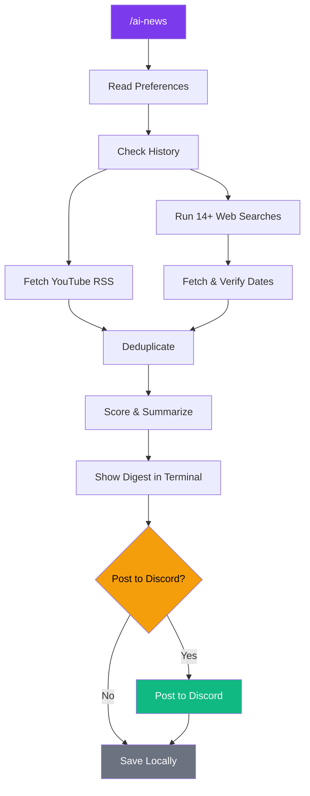

# claude-news

Turn Claude Code into your personal AI news aggregator — it searches the web, checks YouTube, scores articles against your interests, and posts a curated daily digest to Discord. No server, no app, just a slash command.

## How it works



Claude acts as the orchestrator — it reads your preferences, builds search queries, fetches and verifies articles, scores them, and formats everything. The only code in this repo are two small Python scripts for YouTube RSS parsing and Discord posting.

## Project structure

```
.
├── .claude/skills/ai-news/
│   ├── SKILL.md              # The skill — Claude's instructions
│   ├── PREFERENCES.md        # Your interests, news sites, YouTube channels
│   ├── scripts/
│   │   ├── youtube_fetch.py  # Fetch latest videos via RSS
│   │   └── post_discord.py   # Post formatted messages to Discord
│   └── db/
│       └── news.db           # SQLite — items + run history (gitignored)
├── .env                      # DISCORD_TOKEN + NEWS_CHANNEL_ID (gitignored)
├── pyproject.toml
└── uv.lock
```

## Setup

### Prerequisites

- [Claude Code](https://claude.ai/code) CLI installed
- [uv](https://docs.astral.sh/uv/) for Python package management
- A Discord bot token with message permissions

### Install

```bash
git clone <this-repo>
cd aiNewsBot
uv sync
```

### Configure

Create a `.env` file in the project root:

```
DISCORD_TOKEN=your_bot_token_here
NEWS_CHANNEL_ID=123456789012345678  # Discord channel ID where news gets posted
```

To get a channel ID: enable Developer Mode in Discord settings, then right-click any channel and select "Copy Channel ID".

### Customize

Edit `.claude/skills/ai-news/PREFERENCES.md` to configure:

- **"I love this"** — topics that always score high (0.8–1.0)
- **"I like this"** — topics included if they're good (0.5–0.8)
- **"Skip this"** — topics filtered out automatically
- **Preferred news sites** — sites searched with `site:` queries
- **YouTube channels** — RSS feeds checked for latest 2 videos each
- **Scoring boosts/penalties** — fine-tune what floats to the top

## Usage

Open Claude Code in this directory and run:

```
/ai-news
```

Claude will search, fetch, verify, score, and present a digest. You review it in the terminal, then confirm whether to post to Discord.

## Scoring

Each item gets a score from 0.0 to 1.0:

| Range | Meaning |
|-------|---------|
| 0.8–1.0 | "Love" topic — always included |
| 0.5–0.8 | "Like" topic — included if quality is good |
| < 0.5 | Filtered out |

Boosts (+0.1): GitHub repos, code releases, breaking announcements, followed YouTube creators, tool comparisons.

Penalties (-0.1): Clickbait titles, paid announcements without technical depth.

## Date verification

Every web article is fetched and its publish date is extracted from the HTML. Only articles published within the last 7 days are included. URL dates and search snippet dates are never trusted — this has prevented stale articles from leaking through.

YouTube videos skip date verification since the 2-per-channel cap from RSS already ensures freshness.

## Deduplication

URLs are MD5-hashed and checked against the SQLite database before scoring. Near-identical titles to recent items are also skipped. This means you can run `/ai-news` multiple times a day without getting repeats.

## Tech stack

- **Claude Code** — orchestration, searching, scoring, summarization
- **Python** — two small scripts (feedparser + urllib)
- **SQLite** — local storage for items and run history
- **Discord API** — posting via bot token
- **uv** — dependency management
